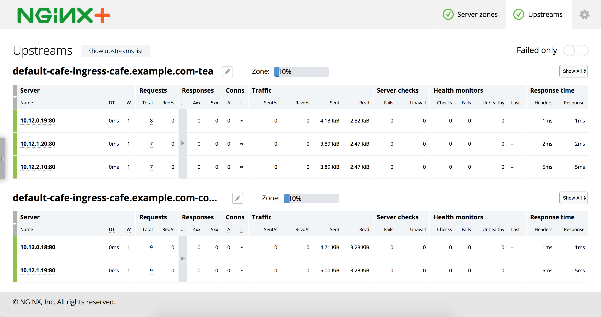

# Example

## Prerequisites

* Kubernetes 1.2 and later (TLS support for Ingress has been added in 1.2)
* For NGINX Plus:
  * Build and make available in your cluster the [NGINX Plus](../../nginx-plus-controller) controller image
  * Update the container image field in the ```nginx-plus-ingress-rc.yaml``` file accordingly.

## Running the Example

## 1. Deploy the Ingress Controller

1. Create either an NGINX or an NGINX Plus Ingress controller:
  ```
  $ kubectl create -f nginx-ingress-rc.yaml
  ```
  or
  ```
  $ kubectl create -f nginx-plus-ingress-rc.yaml
  ```

1. The controller container exposes ports 80, 443 (and 8080 for NGINX Plus )
on the host it is running on. Make sure to add a firewall rule to allow incoming traffic
though these ports.

## 2. Deploy the Cafe Application

1. Create the coffee and the tea services and replication controllers:

  ```
  $ kubectl create -f tea-rc.yaml
  $ kubectl create -f tea-svc.yaml
  $ kubectl create -f coffee-rc.yaml
  $ kubectl create -f coffee-svc.yaml
  ```

## 3. Configure Load Balancing

1. Create a secret with an SSL certificate and a key:
  ```
  $ kubectl create -f cafe-secret.yaml
  ```

1. Create an Ingress Resource:
  ```
  $ kubectl create -f cafe-ingress.yaml
  ```

## 4. Test the Application
1. Find out the external IP address of the node where the controller is. Only use one of these methods
    1. **jq** method, if you don't have this package, [install](https://stedolan.github.io/jq/download/) it or skip to the next step, using grep
```
export INGRESS_IP=$(kubectl get node $(kubectl get pods -o json | jq '.items[] | select(.metadata.name | startswith("nginx-plus-ingress")).spec.nodeName' | tr -d \" ) -o json |  jq '.status.addresses[] | select(.type=="ExternalIP") | .address'| tr -d \")
```
    2. **grep** method 
```
export INGRESS_IP=$(kubectl get node kubernetes-minion-group-b31m -o json | grep -A 2 ExternalIP | grep address | awk '{print $2}' | tr -d \")
```
    3. **long** method: Here's an example of what the above commands are actually doing. Find the ingress pod and take note of the kubernetes node it's running on, and grep for the IP address of that node.
  ```
  $ kubectl get pods -o wide
  NAME                          READY     STATUS    RESTARTS   AGE       NODE
  coffee-rc-mtjuw               1/1       Running   0          3m        kubernetes-minion-iikt
  coffee-rc-mu9ns               1/1       Running   0          3m        kubernetes-minion-cm0y
  nginx-plus-ingress-rc-86kkq   1/1       Running   0          1m        kubernetes-minion-iikt
  tea-rc-7w3fq                  1/1       Running   0          3m        kubernetes-minion-iikt
  ```
  ```
  $ kubectl get node kubernetes-minion-iikt -o json | grep -A 2 ExternalIP
      "type": "ExternalIP",
    "address": "XXX.YYY.ZZZ.III"
    }
  ```

2. To see that the controller is working, let's curl the coffee and the tea services.
We'll use ```curl```'s --insecure option to turn off certificate verification of our self-signed
certificate and the --resolve option to set the Host header of a request with ```cafe.example.com```
  To get coffee:
  ```
  $ curl --resolve cafe.example.com:443:$INGRESS_IP https://cafe.example.com/coffee --insecure
  <!DOCTYPE html>
  <html>
  <head>
  <title>Hello from NGINX!</title>
  <style>
      body {
          width: 35em;
          margin: 0 auto;
          font-family: Tahoma, Verdana, Arial, sans-serif;
      }
  </style>
  </head>
  <body>
  <h1>Hello!</h1>
  <h2>URI = /coffee</h2>
  <h2>My hostname is coffee-rc-mu9ns</h2>
  <h2>My address is 10.244.0.3:80</h2>
  </body>
  </html>
  ```
  If your rather prefer tea:
  ```
  $ curl --resolve cafe.example.com:443:$INGRESS_IP https://cafe.example.com/tea --insecure
  <!DOCTYPE html>
  <html>
  <head>
  <title>Hello from NGINX!</title>
  <style>
      body {
          width: 35em;
          margin: 0 auto;
          font-family: Tahoma, Verdana, Arial, sans-serif;
      }
  </style>
  </head>
  <body>
  <h1>Hello!</h1>
  <h2>URI = /tea</h2>
  <h2>My hostname is tea-rc-w7rjr</h2>
  <h2>My address is 10.244.0.5:80</h2>
  </body>
  </html>
  ```

3. If you're using the Plus controller, you can open the live activity monitoring dashboard, which is available at http://XXX.YYY.ZZZ.III:8080/status.html
If you go to the Upstream tab, you'll see: 
